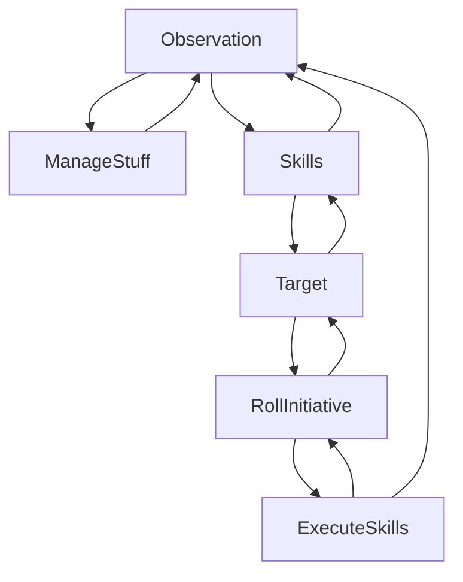

# Fight Arena

## A test arena where i can dev some NPC for our FTO game

### For now

NPC can

- follow the player within a range
- walk around towards random destination

Aggressive NPC can

- detect player and enemy
- chase them
- trigger CombatEvent
  - Display their dialog
- wait 5s before retargeting someone

Player can

- choose answer in dialog
- move around

Collision works thanks to bevy_retrograde

Press o to see the grateful future

[Preview of the demo](https://user-images.githubusercontent.com/73140258/212979807-92f376d4-a974-4827-88af-2687e725bc3b.mp4)

[Release Demo](https://fabinistere.github.io/figh_arena/)

### For a future

- NPC will Avoid collider
  - Pathfind ?
- NPC will have some personnality
  - Implement landmark/place
- Combat system
  - Talk
  - Fight
    - Placement
    - UI
    - Combat Phases

- Cinematics and story
- Menu

## Contribute

Release's format is based on [Keep a Changelog](https://keepachangelog.com/en/1.0.0/),
and this project adheres to [Semantic Versioning](https://semver.org/spec/v2.0.0.html).

This project also follows to [A successful Git branching model](https://nvie.com/posts/a-successful-git-branching-model/).

### Assets deported - Ecological Issue

From now on, all my repertories using music and images that change frequently will have a special folder in our organisation's cloud.
To avoid using the git storage for such maters.
In fact, storing an image in git means that if a single pixel changes, git will completely save the previous image and the next image.
Which turns out to be a complete waste of energy in my case.

SO, to have the assets of the last commit, please download this folder:
[Download Assets](https://drive.google.com/drive/folders/1jcYH7U0qzLvyE25JEkXixoA6EWw6KNN5?usp=share_link)

To find previous assets, they will be indicated in the given database.

## License

This project is free, open source and permissively licensed!

All code in this repository is dual-licensed under either:

- MIT License ([LICENSE-MIT](LICENSE-MIT) or [http://opensource.org/licenses/MIT](http://opensource.org/licenses/MIT))
- Apache License, Version 2.0 ([LICENSE-APACHE](LICENSE-APACHE) or [http://www.apache.org/licenses/LICENSE-2.0](http://www.apache.org/licenses/LICENSE-2.0))

See the very good reasons for including both [here](https://github.com/bevyengine/bevy/issues/2373).
