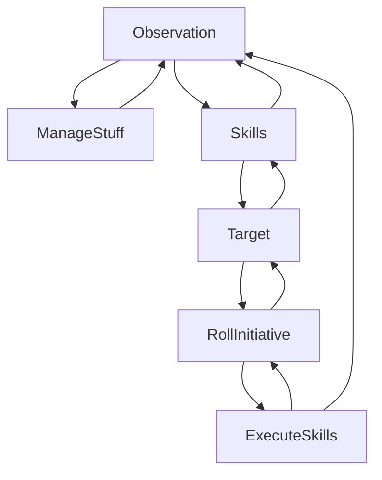

# Fight Arena

## A test arena where i can dev some NPC for our FTO game

### For now

NPC can

- follow the player within a range
- walk around towards random destination

Aggressive NPC can

- detect player and enemy
- chase them
- trigger CombatEvent
  - Display their dialog
- wait 5s before retargeting someone

Player can

- choose answer in dialog
- move around

Collision works thanks to bevy_retrograde

Press o to see the grateful future

[Preview of the demo](https://user-images.githubusercontent.com/73140258/212979807-92f376d4-a974-4827-88af-2687e725bc3b.mp4)

[Release Demo](https://fabinistere.github.io/figh_arena/)

### For a future

- [ ] NPC will Avoid collider
  - [ ] Pathfind ?
  - [ ] Fly Strategy ?
- [ ] NPC will have some personnality
  - [ ] Implement landmark/place
- [x] Combat system
  - [x] Dialog (in this [github repo](https://github.com/Fabinistere/yml_dialog))
    - [x] Talk
    - [x] Trigger Event
  - [x] Fight (in this [github repo](https://github.com/Fabinistere/bevy_turn-based_combat))
    - [x] Placement
    - [x] UI
    - [x] Combat Phases

- Cinematics and story
- Menu

## Contribute

Release's format is based on [Keep a Changelog](https://keepachangelog.com/en/1.0.0/),
and this project adheres to [Semantic Versioning](https://semver.org/spec/v2.0.0.html).

This project also follows to [A successful Git branching model](https://nvie.com/posts/a-successful-git-branching-model/).

### Assets deported - Ecological Issue

From now on, all my repertory using musics and images changing a lot will have a particular folder in our org's cloud.
To avoid using the git storage for such maters.
Indeed store image in git means if only one pixel changed the git will save the previous and the next image completly.
Which happens to be a pure waste of energy in my case.

SO, to have the assets of the last commit, please download this folder:
[assets](https://drive.google.com/drive/folders/1jcYH7U0qzLvyE25JEkXixoA6EWw6KNN5?usp=share_link)

To find previous assets, they will be given in the given realase

## License

This project is free, open source and permissively licensed!

All code in this repository is dual-licensed under either:

- MIT License ([LICENSE-MIT](LICENSE-MIT) or [http://opensource.org/licenses/MIT](http://opensource.org/licenses/MIT))
- Apache License, Version 2.0 ([LICENSE-APACHE](LICENSE-APACHE) or [http://www.apache.org/licenses/LICENSE-2.0](http://www.apache.org/licenses/LICENSE-2.0))

See the very good reasons for including both [here](https://github.com/bevyengine/bevy/issues/2373).
